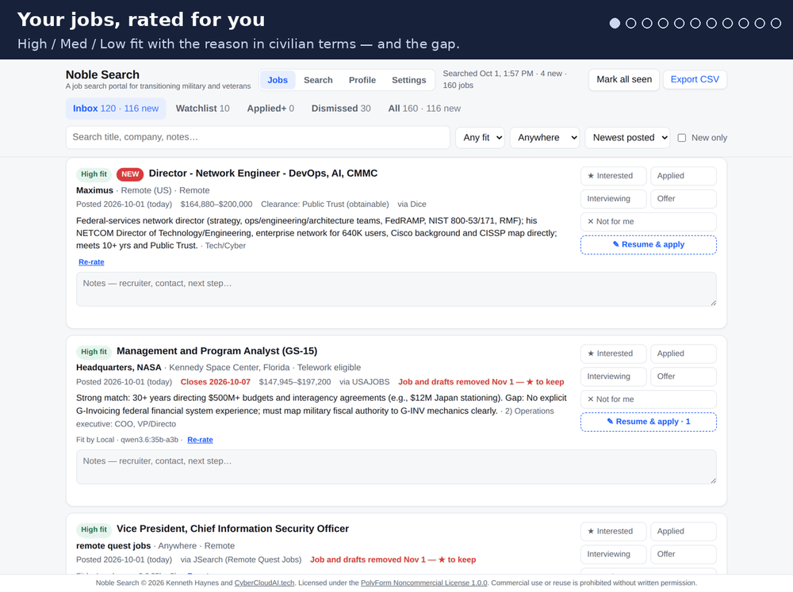
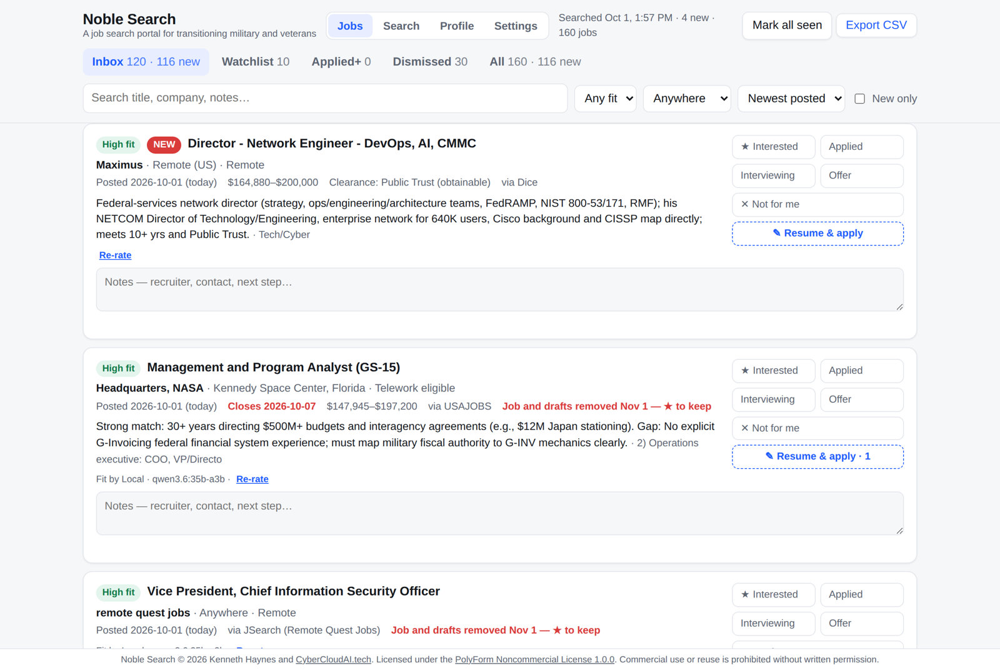
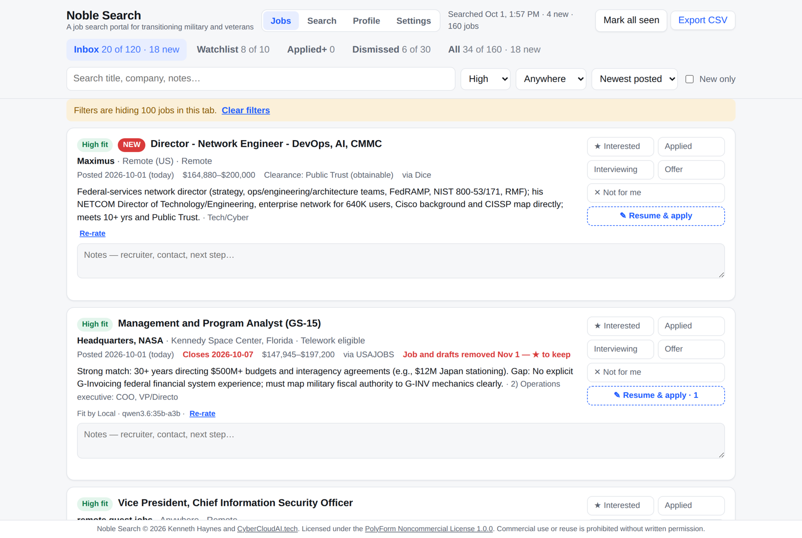
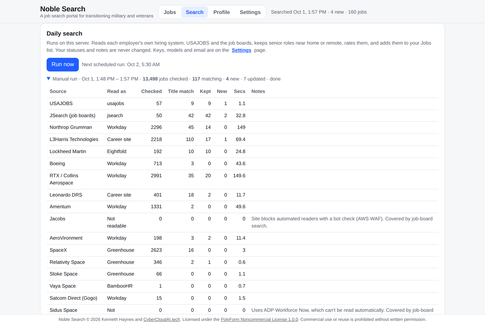
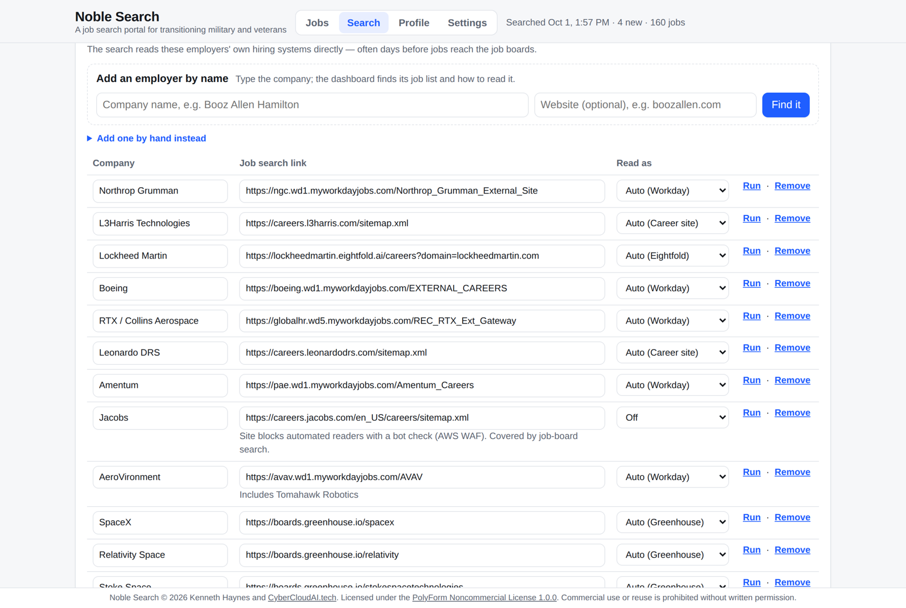
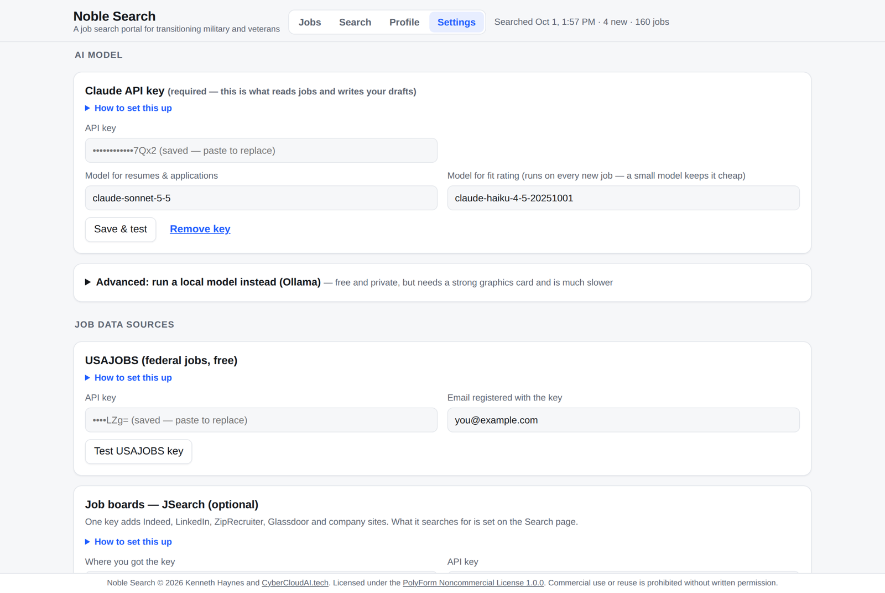
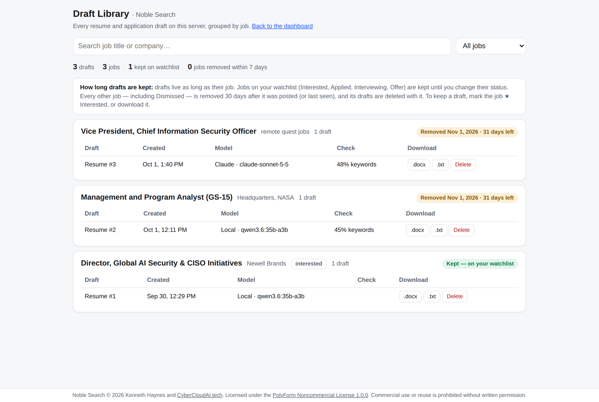
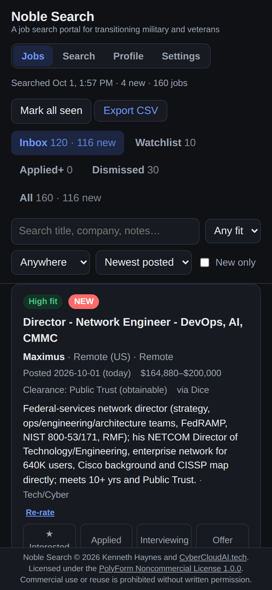
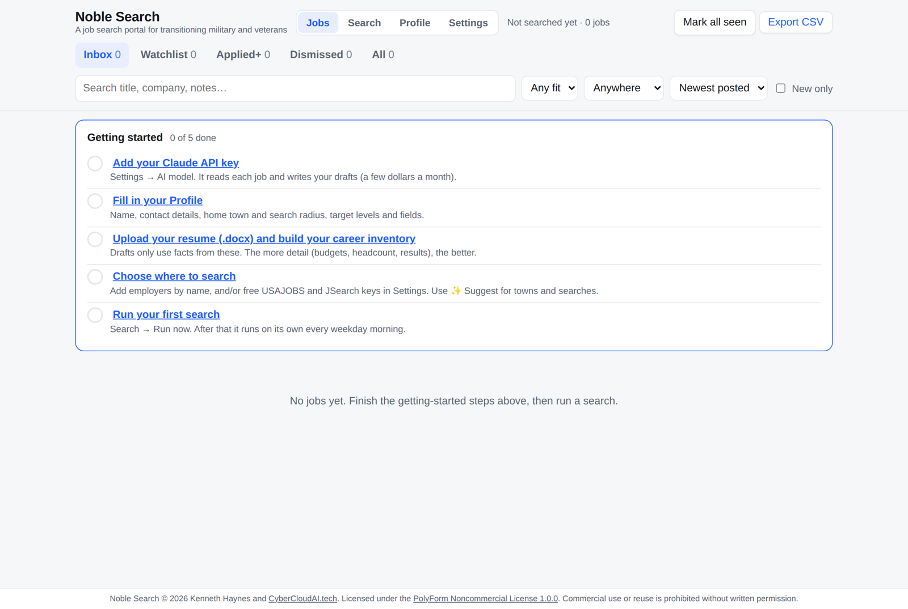

# Noble Search
[](https://github.com/kghaynes/noble-search/actions/workflows/tests.yml)
[](https://github.com/kghaynes/noble-search/releases)
[](LICENSE.md)

**A job search tool for transitioning military and veterans.**

**Why I built this..**
Transitioning from a career in military service to the civilian sector is maddening. The service-member is faced with a maze of new challenges: how does his/her job history translate to civilian minded hire-mangers, how do you write a resume to address potential gaps, how do you find time to search dozens of job board listings to find an opportunity before it closes, how do you filter the thousands of fake/deadend/low match jobs? 

Yes, it's a tough job market. But for recently transitioning veterans who are entering it for the first time, the problem appears substantially worse. Nearly one-third of veteran job seekers are underemployed, about 15% higher than non-veterans. A longitudinal study found 61% were underemployed three years after leaving the military. That broader measure includes jobs that do not adequately use the veteran’s skills, education, or experience (Syracuse study). It is a major contributing factor to the veteran suicide rate of nearly 18 veterans per day (2023 data). Let that sink in for a moment.

I care about my fellow soldiers and veterans (airman, marines, sailors, guardians, and coasties too!). So Noble-Search is born out of my personal frustration and a means to give back and serve my community....  "Just imagine if every Colonel took the time, each day, to solve the problem one Soldier faces. Just imagine how great our Army could be." - GEN Richard Cody to a (then) young Major Ken Haynes circa 2006.

<p align="center">
  
</p>

Noble Search runs on your own computer. Every weekday morning it:

1. **Searches** for jobs that match you and your preferences, not random free search texts. It looks at the hiring websites of employers you pick, at USAJOBS, and at the big job boards (LinkedIn, Indeed, Glassdoor, ZipRecruiter and others).
2. **Rates each job** High, Medium or Low fit for *your* background. Each rating comes with a one-line reason in civilian terms and names any gap.
3. **Emails you a short summary** (optional).
4. **Pushes you a phone notification** (optional).
5. **Uses Frontier or locally hosted AI Models**. 

When you find a job you like, one click writes a **tailored resume** for it, as a Word file in your own resume's layout. Another click writes the **application text**: summary, work-history entries, screening answers and cover letter, ready to copy into the employer's application form.

Everything is kept on your computer. You bring your own AI key, which costs a few dollars a month (see [What it costs](#what-it-costs)).

> **Why "translate"?** Recruiters and hiring software look for civilian words. "Deputy Commanding Officer, 5,000 personnel" becomes "Chief Operating Officer–level leader of a 5,000-person organization." Noble Search does this in every rating and draft, and it only ever uses facts you gave it.

---

## Contents

- [Screenshots](#screenshots)
- [What it does](#what-it-does)
- [What it costs](#what-it-costs)
- [What you need](#what-you-need)
- [Install](#install)
  - [Step 1 — Install Docker](#step-1--install-docker)
  - [Step 2 — Download Noble Search](#step-2--download-noble-search)
  - [Step 3 — Start it](#step-3--start-it)
- [First-time setup (about 30 minutes)](#first-time-setup-about-30-minutes)
- [Getting your keys](#getting-your-keys)
- [Using it day to day](#using-it-day-to-day)
- [How the search works](#how-the-search-works)
- [How long things are kept](#how-long-things-are-kept)
- [Privacy and security](#privacy-and-security)
- [Opening it from your phone or another computer](#opening-it-from-your-phone-or-another-computer)
- [Updating, backing up, stopping and removing](#updating-backing-up-stopping-and-removing)
- [Troubleshooting](#troubleshooting)
- [Advanced](#advanced)
- [Getting help and contributing](#getting-help-and-contributing)
- [Disclaimer](#disclaimer)
- [License](#license)

## Screenshots

Click any picture to see it full size. The jobs shown come from a real daily run.

<table>
  <tr>
    <td align="center" width="50%"><a href="docs/screenshots/01-jobs.png"></a><br><sub>Jobs, rated High / Med / Low with the reason and the gap</sub></td>
    <td align="center" width="50%"><a href="docs/screenshots/02-high-fit.png"></a><br><sub>Filtered to High fit</sub></td>
  </tr>
  <tr>
    <td align="center" width="50%"><a href="docs/screenshots/03-search.png"></a><br><sub>Daily search — every source in one run</sub></td>
    <td align="center" width="50%"><a href="docs/screenshots/04-employers.png"></a><br><sub>Add an employer by name</sub></td>
  </tr>
  <tr>
    <td align="center" width="50%"><a href="docs/screenshots/05-settings.png"></a><br><sub>Settings — bring your own keys</sub></td>
    <td align="center" width="50%"><a href="docs/screenshots/06-library.png"></a><br><sub>Draft Library</sub></td>
  </tr>
  <tr>
    <td align="center" width="50%"><a href="docs/screenshots/07-mobile-dark.png"></a><br><sub>Phone, dark mode</sub></td>
    <td align="center" width="50%"><a href="docs/screenshots/08-getting-started.png"></a><br><sub>Getting-started checklist</sub></td>
  </tr>
</table>

---

## What it does

| Page | What you do there |
|---|---|
| **Jobs** | Your list of found jobs, in tabs: Inbox, Watchlist, Applied+, Dismissed, All. Mark each job ★ Interested, Applied, Interviewing, Offer or Dismissed, and add notes. Filter by fit, near home or remote, or by text. Export everything to a spreadsheet (CSV). |
| **Search** | How the daily search behaves: when it runs, which employers to read, which job-board searches to run, which job titles count, and which towns count as "near home". You can also run a search right now. |
| **Profile** | Tell it about you: contact details, home town and search radius, target levels and fields, your resume (.docx), and a long **career inventory** (every role, budget, headcount and result). Ratings and drafts only use what is here. |
| **Settings** | Things you set up once: your AI key, job-data keys (USAJOBS, JSearch) and the morning email or phone alert. Each box has step-by-step "How to set this up" instructions with links, and a Test button. |
| **Draft Library** | Every resume and application draft, grouped by job, with the time left before it is removed, and download and delete buttons. Open it from Settings → Saved drafts. |

On each job:

- **Fit rating.** High, Med or Low, the role's lane, the strongest match with your background, and the gaps (for example "gap: no FedRAMP experience").
- **✎ Resume & apply**, which opens three tools:
  - **Resume draft.** A Word (.docx) resume aimed at this job:
    - built from your own resume file, so fonts, margins and headings match
    - fixed for hiring software (ATS): plain bullets, no special symbols, one column
    - every number checked against your Profile; anything it can't trace is flagged "to verify"
  - **Application text.** Blocks for Workday-style forms (summary, one entry per job, skills, "why this company", screening answers, cover letter). Each block has a character count and a Copy button.
  - **Keyword check.** Compares the posting's key terms with your draft and sorts them into three groups: covered, "you have this — add it", and "not in your Profile".

**It will never** fill in or submit an application for you, make up experience, or try to get past a website's bot check. You stay in control of every application.

---

## What it costs

The software is **free** for personal and noncommercial use to help *you* the veteran/service-member seek employment (see [License](#license)). The services it uses:

| Service | Needed? | Cost |
|---|---|---|
| **Claude API** (the AI) | **Yes**, unless you run your own local model (see [Advanced](#use-a-local-ai-model-instead-of-claude-ollama)) | Prepaid credit. Nothing is charged automatically. Typical use: **about $2–$10 a month for fit ratings**, plus **about 5–15 cents per resume or application draft**. A $10 credit lasts most people a month or more. |
| **USAJOBS API** (federal jobs) | Optional | Free |
| **JSearch** (LinkedIn, Indeed, Glassdoor, ZipRecruiter…) | Optional, recommended | Free plan: 200 searches a month, enough for about 7 searches every weekday |
| **Gmail** (morning email) | Optional | Free. Needs a Gmail "app password". |
| **ntfy** (phone alert) | Optional | Free |

Three things keep the AI cost low:

- Fit rating uses Claude's smallest, cheapest model (Haiku).
- Your profile is sent in a way Claude can **cache** (keep for a few minutes), so rating many jobs in a row costs about a tenth as much per job.
- Drafts use the stronger model (Sonnet).

You can change either model in Settings.

---

## What you need

- **A computer that can be on (or wake up) in the morning.** A Mac, Windows PC or Linux machine.
  - A small home server or an always-on desktop is best.
  - A laptop works if it's awake when the search runs. A missed search runs when the computer comes back, up to 6 hours late.
- **Docker.** This free program runs Noble Search in a sealed box, so you don't have to install anything else. Steps are below.
- **About 1 GB of disk space.**
- **Your resume as a Word (.docx) file.**
- **A credit card** to put $5–$10 of prepaid credit on the Claude API.

You do **not** need to know how to program. You will copy and paste a few commands, and each one is explained.

---

## Install

### Step 1 — Install Docker

**Mac**

1. Go to <https://www.docker.com/products/docker-desktop/> and click **Download for Mac**.
   - Choose "Apple Silicon" for M1/M2/M3/M4 Macs, "Intel chip" for older ones.
   - Not sure? Apple menu → About This Mac.
2. Open the downloaded `.dmg` file and drag **Docker** into **Applications**.
3. Open Docker from Applications and accept the agreement. You can skip signing in.
4. Wait until the whale icon in the menu bar stops moving. Docker is now running.

**Windows 10/11**

1. Go to <https://www.docker.com/products/docker-desktop/> and click **Download for Windows**.
2. Run the installer and keep the default "Use WSL 2" option. Restart when asked.
3. Open **Docker Desktop** from the Start menu and wait until it says "Engine running".
4. For the commands below, use **PowerShell** (Start menu → type "PowerShell").

**Linux (Ubuntu/Debian)**

```bash
curl -fsSL https://get.docker.com | sudo sh
sudo usermod -aG docker $USER     # lets you run docker without sudo
```

Then log out and back in.

**Check that Docker works.** Open a terminal (on a Mac: Applications → Utilities → Terminal; on Windows: PowerShell) and type:

```bash
docker --version
docker compose version
```

Both should print a version number. If you see "command not found", Docker isn't running yet. Open Docker Desktop and wait a minute.

### Step 2 — Download Noble Search

**Option A — with git** (recommended; updating later is one command):

```bash
git clone https://github.com/kghaynes/noble-search.git
cd noble-search
```

If git isn't installed:

- **Mac:** typing `git` offers to install it. Click Install.
- **Windows:** install it from <https://git-scm.com/download/win>.
- **Linux:** run `sudo apt install git`.

**Option B — without git:**

1. On the GitHub page, click the green **Code** button → **Download ZIP**.
2. Unzip it.
3. Open a terminal in that folder:
   - **Mac:** right-click the folder → Services → New Terminal at Folder.
   - **Windows:** open the folder, click the address bar, type `powershell` and press Enter.

### Step 3 — Start it

From inside the `noble-search` folder:

```bash
cp .env.example .env
docker compose up -d --build
```

- `cp .env.example .env` makes your own settings file. `cp` also works in Windows PowerShell.
- `docker compose up -d --build` builds Noble Search and starts it in the background. The first time takes 1–3 minutes.

Now open **<http://localhost:8093>** in your web browser. You should see the **Getting started** checklist.

Noble Search starts by itself whenever Docker starts. To make it fully automatic, set Docker Desktop to start at login: Settings → General → "Start Docker Desktop when you sign in".

> **Optional:** open `.env` in any text editor to change your time zone (`TZ`), the port, or who can reach the page. Every line is explained in the file. After editing, run `docker compose up -d` again.

---

## First-time setup (about 30 minutes)

The **Jobs** page shows a five-step checklist. Each step links to the right page and is ticked off when it's done.

### 1. Add your Claude API key (Settings)

Follow [Claude API key](#claude-api-key-required) below. Paste the key into **Settings → AI model** and click **Save & test**. You should see a ✓.

### 2. Fill in your Profile

On the **Profile** page, fill in these fields, then click **Save**:

- **Name, phone, email, LinkedIn, clearance.** These go at the top of every resume.
- **Home location and radius (miles).** A town or full address. Together they decide what counts as "near home".
- **Work modes and employment types.** Work modes: On-site, Hybrid, Remote. Employment types: W2, 1099.
- **Target levels.** For example "Director, Senior Director, VP" or "Program Manager, Senior Manager".
- **Target fields.** For example "IT, cybersecurity, operations, space".
- **Notes.** Anything the writer should know, for example "Prefer 'led' over 'commanded'" or "Never mention X".

### 3. Upload your resume and build your career inventory (Profile)

1. **Upload your resume (.docx).**
   - You can upload more than one, for example a federal and a corporate version.
   - Pick one as the **layout template**. New drafts copy its fonts, margins and page setup.
2. **Write your career inventory.** This is the most important step. List everything you've done, role by role:
   - title, organization and dates (MM/YYYY)
   - people led, budget, number of sites or users
   - results, with numbers
   - certifications, education, clearance
   - your own **civilian translations** of military titles, for example "Brigade S6 = Director of IT for a 4,000-person organization"
3. **Or start from a draft.** Click **Draft an inventory from my resumes** to have the AI write a first version from your uploaded resumes. Then *check it carefully*, add what's missing, and click **Save inventory**.

> Drafts can only use facts that are in your inventory and resumes. Any number the AI writes that it can't find there is flagged "to verify".

### 4. Choose where to search (Search page, plus keys in Settings)

Use any mix of these three sources:

- **Employers you're interested in** (no key needed).
  1. Under **Employers → Add an employer by name**, type a company (for example "Booz Allen Hamilton") and click **Find it**.
  2. Noble Search looks for the company's job list, checks that it can read it, and shows how many open jobs it found.
  3. Click **Add to my list**.
  4. If the company isn't found, use **Add employer manually**. The steps are on the page.
- **USAJOBS** (free key, federal jobs). See [USAJOBS key](#usajobs-key-optional-free).
- **Job boards through JSearch** (free key). See [JSearch key](#jsearch-key-optional-free-plan). Then, on the Search page, click **✨ Suggest searches from my Profile** to get ready-made search lines, and edit them as you like.

Also on the Search page:

- **What counts as a match → Start from a preset.** Pick *Executive & senior leadership*, *Manager & senior professional*, or *Any title*. This fills in the title words, which you can then edit.
- **Towns that count as near home.** Click **✨ Suggest towns near my home** to fill in the towns within your radius. If you leave it empty, only your home town counts.
- **Schedule.** Default: 5:30 AM, Monday to Friday, in your time zone.

Click **Save search settings**.

### 5. Run your first search

Click **Run now** on the Search page.

- The first run reads everything posted in the last 30 days, so it can take 5–15 minutes.
- Open **▸ the run summary** to see each source: jobs checked, matches, new jobs, and errors.
- When the search finishes, the new jobs are rated and appear on the **Jobs** page.

From then on, it runs by itself on your schedule.

### Optional: the morning email

Under **Settings → Notifications → Morning email**, follow [Gmail app password](#gmail-app-password-optional-for-the-morning-email), then click **Send a test email**.

---

## Getting your keys

Keys are like passwords for online services. Noble Search keeps them in the `data/` folder on your computer. Once a key is saved, the page only ever shows its last few characters.

### Claude API key (required)

1. Go to <https://platform.claude.com/> and sign up.
   - This is **separate** from a Claude.ai chat subscription. A Pro or Max plan does not include API credit.
2. Open **Settings → Billing** (<https://platform.claude.com/settings/billing>) and add prepaid credit. $5–$10 is plenty to start. New credit can take a few minutes to show up.
3. Open **Settings → API keys** (<https://platform.claude.com/settings/workspaces/default/keys>) and click **Create key**.
   - Name it "Noble Search".
   - Copy it. It starts with `sk-ant-` and is **shown only once**.
4. In Noble Search, open **Settings → AI model**, paste the key, and click **Save & test**.

Tips:

- Set a monthly spending limit under Settings → Limits, so the bill can never surprise you.
- If the test says "credit balance too low", wait 5 minutes.
- Also make sure the credit and the key are in the same organization. The organization name is shown at the top left of the Claude Console.

### USAJOBS key (optional, free)

1. Request a key at <https://developer.usajobs.gov/apirequest/>. If that page shows an error, use the "API Request" link on <https://developer.usajobs.gov/>.
2. The key arrives by email within minutes.
3. In **Settings → USAJOBS**:
   - paste the key
   - type **the same email address** you used to request it (USAJOBS checks that they match)
   - click **Test USAJOBS key**
4. On the Search page, set the **lowest GS grade** you want. The default is GS-14. Senior Executive Service (ES), SL and ST jobs are always kept.

### JSearch key (optional, free plan)

JSearch reads **Google for Jobs**, which is Google's index of public job postings. One key covers LinkedIn, Indeed, Glassdoor, ZipRecruiter, many smaller boards, and company career sites.

1. Open <https://rapidapi.com/letscrape-6bRBa3QguO5/api/jsearch> and sign up. Google sign-in works.
2. Click **Pricing** and subscribe to the free **Basic** plan: 200 requests a month, no card needed.
3. On the API page, copy the value shown as **X-RapidAPI-Key**.
4. In **Settings → Job boards — JSearch**, choose "RapidAPI", paste the key, and click **Test JSearch key**. The test uses 1 request.

How the requests add up:

- Each line under "Job-board searches" on the Search page uses one request per run.
- The page shows your estimated monthly use. Stay under 200 on the free plan.

You can also buy the key directly from OpenWeb Ninja (<https://www.openwebninja.com/api/jsearch>). If you do, pick that option in Settings.

### Gmail app password (optional, for the morning email)

Gmail doesn't let other programs use your normal password, so you create a separate 16-letter **app password**:

1. Turn on **2-Step Verification**, if it's not already on: <https://myaccount.google.com/signinoptions/twosv>
2. Create an app password at <https://myaccount.google.com/apppasswords>. Name it "Noble Search" and copy the 16 letters.
3. In **Settings → Morning email**:
   - tick **Send the morning email**
   - enter your Gmail address as both **Send to** and **Sending account**
   - paste the app password (spaces are fine)
   - click **Send a test email**

Other email providers work too. Enter their SMTP server and port (587, or 465), and an app password if they offer one.

### ntfy phone alert (optional, free)

1. Install the **ntfy** app on your phone (<https://ntfy.sh>).
2. Subscribe to a topic with a hard-to-guess name, for example `noble-search-7f3k9`. Anyone who knows the name can read it.
3. In **Settings → Phone push**, enter `https://ntfy.sh` and the same topic name.

The alert arrives with the morning email.

---

## Using it day to day

1. **Morning.** Read the email, or open the Jobs page. New jobs have a **NEW** badge.
2. **Triage.**
   - **★ Interested** keeps a job on your Watchlist forever.
   - **Dismiss** hides it from the Inbox.
   - **Notes** save automatically.
3. **Apply.** On a job you like, click **✎ Resume & apply**.
   1. **Get the job description into the box.** If the search saved the posting text, it's already filled in. If not, click **Fetch from posting** or paste the text yourself. Some employer sites only work by pasting.
   2. **Click Draft resume.** It takes about 30–90 seconds, and you can keep working meanwhile. Download the **.docx**, read every line, and fix anything marked "to verify".
   3. **Click Draft application text.**
      - If you want the form's own screening questions answered, paste them in first, one per line.
      - Then **Copy** each block into the employer's form.
      - Answers marked **[confirm]** need facts that aren't in your Profile. Check them yourself.
   4. **Check the keyword chips.** "Add — you have these" are posting terms your Profile supports but your draft doesn't use yet.
4. **Track.** Move the job through Applied → Interviewing → Offer.
5. **Export.** **Export CSV** gives you a spreadsheet of everything.

To rate a job again, for example after improving your inventory, click **Re-rate** on its card.

---

## How the search works

For each employer on your list, Noble Search reads the employer's **own hiring system** directly. That is the same list their careers page shows, and new jobs often appear there days before they reach job boards. It can read these systems:

| Hiring system | Used by (examples) |
|---|---|
| Workday | Many large defense, aerospace and IT companies |
| Greenhouse, Lever, Ashby | Many tech companies and start-ups |
| SmartRecruiters, BambooHR | Many mid-size companies |
| Eightfold | Some large companies |
| Career-site sitemap | Sites that publish structured job data |

It **cannot** read these systems:

- ADP, iCIMS, Taleo, Oracle
- Jobvite, Paylocity, UKG, Dayforce
- JazzHR, Paycom, Workable, Breezy, Rippling, Avature, Phenom
- any site protected by a bot check

The employer finder tells you when it sees one of these. Jobs from those employers often still show up through **JSearch**, because Google indexes them.

The other two sources:

- **USAJOBS** is searched near your home town, plus a separate search for remote jobs.
- **JSearch** runs each of your search lines once per run, for jobs posted in the last month.

Every job found is then filtered. It is kept only if:

- its title contains one of your title words, and none of your "skip" words
- its location is one of your towns, your home town, or remote (if you accept remote)
- it was posted within the last 30 days (you can change this)

If the same job is found in several places, it becomes one card that keeps the employer's own link. Your statuses and notes are **never** changed by a search.

After the search, each **new** job is rated once. Jobs that already have a rating keep it unless you click Re-rate.

---

## How long things are kept

- **Watchlist jobs** (Interested, Applied, Interviewing, Offer) are **kept until you change their status**.
- **Every other job, Dismissed included,** is removed **30 days after it was posted** (or last seen).
  - Its drafts are deleted with it.
  - The job is not added back later.
- Each card and the Draft Library show the date a job will be removed. To keep a draft, star the job or download the draft.
- To change the 30 days, set `MAX_AGE_DAYS` in `.env`.

---

## Privacy and security

**Your data stays on your computer**, in the `data/` folder next to the program:

- `jobs.db`: jobs, statuses and notes
- `profile/`: your profile, resumes and inventory
- `drafts/`: your drafts
- `settings.json` and `search.json`: settings and keys, readable only by the program

**What leaves your computer:**

- **To Anthropic (the Claude API),** when rating a job or writing a draft: your profile, career inventory and resume text, plus the job posting. Anthropic's commercial terms say API data is not used to train their models: <https://www.anthropic.com/legal/commercial-terms>. If you want nothing sent out, use a [local model](#use-a-local-ai-model-instead-of-claude-ollama).
- **To job sites, USAJOBS and JSearch:** only searches (job titles and your town), never your profile.
- **To your email provider:** the morning summary.

**Other protections:**

- **Keys are never sent to the web page.** It only shows their last few characters.
- **Only this computer can open the page by default** (`BIND_ADDRESS=127.0.0.1` in `.env`). If you open it to your home network, also set `APP_PASSWORD` (see below).
- **No account and no reporting.** There is no sign-up, and nothing is reported back to the author.

---

## Opening it from your phone or another computer

**Option 1 — on your home network**

1. Edit `.env` and set:
   ```
   BIND_ADDRESS=0.0.0.0
   APP_PASSWORD=pick-a-long-password
   ```
2. Run `docker compose up -d` again.
3. Find your computer's network address:
   - **Mac:** System Settings → Wi-Fi → Details → "IP address"
   - **Windows:** run `ipconfig` and look for "IPv4 Address"
   - **Linux:** run `hostname -I`
4. On your phone, on the same Wi-Fi, open `http://THAT-ADDRESS:8093`.
5. Log in with any user name and your `APP_PASSWORD`.

**Option 2 — from anywhere, privately (recommended)**

1. Install **Tailscale** (<https://tailscale.com>, free for personal use) on the computer and on your phone, and sign in with the same account on both.
2. Keep the `.env` settings from Option 1.
3. On your phone, open `http://COMPUTER-NAME:8093`.

Your devices talk over a private, encrypted network, and nothing is exposed to the internet.

> **Never** forward port 8093 on your router to the internet.

---

## Updating, backing up, stopping and removing

**Update to the newest version.** Your data is kept.

```bash
cd noble-search
./scripts/update.sh
```

- **On Windows:** run `git pull` and then `docker compose up -d --build` instead.
- **If you used the ZIP:** download the new ZIP, copy your `data/` folder and `.env` file into it, then start it.

**Back up.** Copy the `data/` folder and the `.env` file somewhere safe. To restore, put them back and run `docker compose up -d`.

**Other commands:**

| To… | Run |
|---|---|
| See what it's doing | `docker compose logs --tail 100` |
| Stop it | `docker compose down` |
| Start it again | `docker compose up -d` |
| Remove the program | `docker compose down --rmi local`, then delete the `noble-search` folder |

Deleting the folder also deletes your data, so back it up first.

---

## Troubleshooting

| Problem | What to do |
|---|---|
| The page won't open | 1. Make sure Docker Desktop is running. 2. Run `docker compose ps`; it should say "running (healthy)". 3. Run `docker compose logs --tail 50` to see errors. 4. Use `http://` (not https) and the right port. |
| "Port is already allocated" | Something else is using port 8093. Set `HOST_PORT=8094` in `.env`, run `docker compose up -d`, and open `http://localhost:8094`. |
| Claude test: "credit balance is too low" | Credit can take a few minutes to apply. Also check that the key and the credit are in the same organization in the Claude Console. |
| Claude test: "invalid x-api-key" | The key may have been cut off when you pasted it. Copy it again, or create a new key. |
| Jobs say "Not rated" | Check the Claude key in Settings. On the Search page, click **Rate N unrated jobs**; errors show next to that button. |
| USAJOBS: "401" or "unauthorized" | The email address must be exactly the one you requested the key with. |
| JSearch: "429" or "limit reached" | You've used this month's requests. Remove some search lines, or wait for next month. |
| Email: "rejected the login" | Gmail needs an **app password**, not your normal password. See [Gmail app password](#gmail-app-password-optional-for-the-morning-email). |
| Email: "connection unexpectedly closed" | Try port 465 instead of 587. Some networks block one of them. |
| An employer shows "bot check" or "can't be read" | That site blocks automatic reading. Set it to **Off** in the employer list. Its jobs often still come through JSearch. Noble Search never tries to get around bot checks. |
| "Fetch from posting" can't read a job | Some sites need a real browser. Copy the posting text and paste it into the box. |
| Too many or too few jobs found | Adjust the title words, "skip" words and towns on the Search page. Open the run summary to see which source found what. |
| The scheduled search didn't run | The computer was off or asleep. It catches up when it comes back, up to 6 hours late. Make sure Docker starts at login. |

---

## Advanced

### Settings in `.env`

| Setting | Default | What it does |
|---|---|---|
| `TZ` | `America/New_York` | Your time zone, used for the schedule |
| `BIND_ADDRESS` | `127.0.0.1` | `127.0.0.1` = this computer only; `0.0.0.0` = your network |
| `HOST_PORT` | `8093` | The port the page is served on |
| `APP_PASSWORD` | (empty) | If set, the page asks for this password |
| `MAX_AGE_DAYS` | `30` | How long non-watchlist jobs are kept, in days |
| `OLLAMA_URL` / `OLLAMA_MODEL` | | Local model server (see below) |

To apply changes, run `docker compose up -d`.

### Use a local AI model instead of Claude (Ollama)

A local model is free and fully private. The trade-offs:

- It needs a strong graphics card (16 GB or more of video memory recommended).
- It is much slower: about 15–60 seconds per rating and 1–3 minutes per draft.

To set it up:

1. Install Ollama from <https://ollama.com/download>, then download a model, for example `ollama pull qwen3:14b`.
2. In **Settings → Advanced: run a local model instead**, set the Ollama address:
   - **Ollama on the same computer:** keep `http://host.docker.internal:11434`.
   - **Ollama on another computer:** set `OLLAMA_HOST=0.0.0.0` on that computer, and enter its address here.
3. Click **Test connection**. Choose **Local model** for writing, fit rating, or both, and Save.
4. Keep the **context window** at 24,576 or more. A smaller window silently cuts off part of your profile.

### Run without Docker

This needs Python 3.12 or newer.

```bash
pip install -r requirements.txt
mkdir -p data
DB_PATH=./data/jobs.db PORT=8093 python3 app.py
```

### Run the tests

```bash
python3 -m unittest discover -s tests
```

### Project layout

| File | What it does |
|---|---|
| `app.py` | Web server, database, job list, retention, page routes |
| `search.py` | Daily search: settings, schedule, merging results into the job list |
| `sources.py` | Readers for each hiring system, plus USAJOBS and JSearch |
| `discover.py` | "Add an employer by name": finds a company's job list |
| `fit.py` | Fit rating: High/Med/Low, lane, reason and gaps |
| `suggest.py` | ✨ Suggest towns and job-board searches |
| `notify.py` | Morning email and ntfy push |
| `llm.py` | Talks to the Claude API or Ollama |
| `profile_store.py` | Profile, resumes, career inventory, settings |
| `resume.py`, `apply.py`, `drafts.py` | Resume drafts (.docx), application text, keyword check, draft queue |
| `static/index.html`, `static/library.html` | The web pages (plain HTML and JavaScript, no build step) |
| `data/` | **Your** data. Created on first run and never committed to git. |

Besides Python itself, the only library used is `python-docx`.

---

## Getting help and contributing

- **Questions:** [Discussions → Q&A](https://github.com/kghaynes/noble-search/discussions)
- **Bugs, ideas, or an employer that can't be read:** [open an issue](https://github.com/kghaynes/noble-search/issues/new/choose)
- **Security problems:** report privately. See [SECURITY.md](SECURITY.md).
- **Code and docs:** see [CONTRIBUTING.md](CONTRIBUTING.md). Contributions need the license grant described there.
- **What changed in each version:** [CHANGELOG.md](CHANGELOG.md)

---

## Disclaimer

Noble Search is an independent personal project. It is not affiliated with or endorsed by the Department of Defense, the Department of Veterans Affairs, USAJOBS, any employer, or any job board.

AI-written drafts can contain mistakes. **Read and check every draft before you send it.** You are responsible for what you submit.

---

## License

Noble Search © 2026 Kenneth Haynes and CyberCloudAI (<https://cybercloudai.tech>).

It is licensed under the **PolyForm Noncommercial License 1.0.0**. The full text is in [LICENSE.md](LICENSE.md).

- **You may** use, copy and change it for personal job searching, study and other noncommercial purposes. Charities, schools, public-safety and government organizations may use it too.
- **Job hunting counts as noncommercial.** Using Noble Search to look for your own job, including contract or consulting work, is a permitted use. This is written into [LICENSE.md](LICENSE.md) as an additional permission.
- **You may not** sell it, offer it as a paid service, or use it commercially **without written permission**. For commercial licensing, contact CyberCloudAI.

"Noncommercial" means this is *source-available*. It is not "open source" in the OSI sense.
